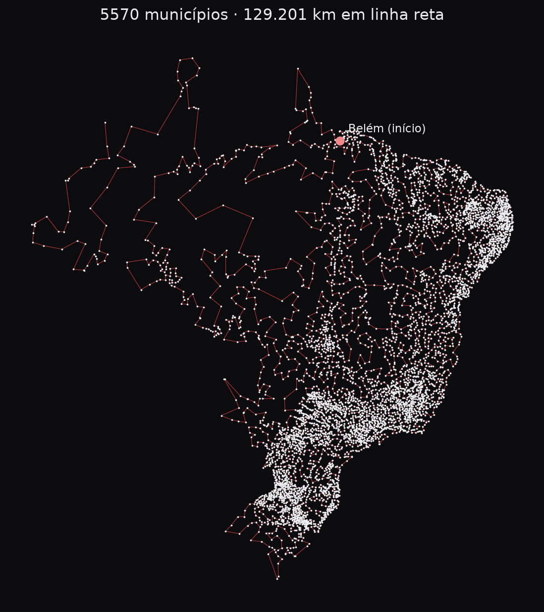

# 02 · Menor rota para visitar todas as cidades

Dada uma cidade de partida, em que ordem visitar todos os municípios (ou só alguns estados, ou só as capitais) percorrendo a menor distância? É o problema do caixeiro-viajante.



## Dá para achar a menor rota?
| Tamanho | Resposta | Exemplo |
|---|---|---|
| até algumas centenas de cidades | **sim, com prova** (`exato.py`) | 27 capitais: 0,1 s · Paraíba (223): 15 s · Paraná (399): 7 min |
| milhares de cidades | **rota muito boa em segundos**, sem prova de que é a menor (`rota.py`) | Brasil (5.570): 129.201 km em ~1 min |

- O problema é NP-difícil: não se conhece um jeito de provar o ótimo para milhares de cidades num tempo razoável num computador comum.
- Para ter noção da qualidade, calibrei a heurística nos estados onde o ótimo foi provado: ela ficou **0,4% a 1,4% acima do ótimo** (Paraná, Paraíba, Sergipe) e acertou em cheio Rondônia e as capitais.
- Existe um limite inferior garantido, a árvore geradora mínima, e nenhuma rota fica abaixo dele. Para o Brasil, a rota está no máximo 14% acima do ótimo. Esse é o pior caso teórico; pelo que se viu nos estados, deve ficar bem mais perto.
- Dois jeitos de medir a distância: **linha reta** (sobre a esfera da Terra) e **estrada** (`--modo estrada`). O modo `--modo comparar` roda os dois nas mesmas cidades.

## Linha reta x estrada
A linha reta é simples, mas subestima a viagem real. No modo estrada, a distância vem de uma matriz pronta de distâncias e tempos de viagem pelas rodovias entre 5.565 municípios: [Saldanha (2024), Zenodo](https://zenodo.org/records/11400243), CC BY 4.0, calculada com o OSRM (perfil carro) sobre o OpenStreetMap de maio de 2024. O `estradas.py` baixa (154 MB) e monta a matriz na primeira vez.

| Saindo de Belém | linha reta (no mapa) | a mesma ordem, na estrada | planejada pela estrada | economia |
|---|---|---|---|---|
| 27 capitais (ótimo comprovado nos dois modos) | 12.842 km | 18.508 km · 287 h | **17.885 km · 269 h** | 624 km (3,4%) |
| Brasil (5.556 municípios) | 130.447 km | 225.989 km · 6.379 h | **192.083 km · 5.463 h** | 33.905 km (15%) |

- Pela estrada, o caminho é tipicamente 30% maior que em linha reta (mediana de 1,30 entre pares de municípios). Na Amazônia e no Amapá, chega a mais que o dobro, por causa das balsas.
- Planejar em linha reta e depois dirigir sai caro: a ordem que parece curta no mapa atravessa rios e baías que, pela estrada, viram grandes desvios.
- **Ficam de fora no modo estrada (14):** 8 municípios sem rota por estrada nem balsa mapeada (Tefé, Carauari, Eirunepé, Itamarati, Autazes e Nova Olinda do Norte no AM; Faro e Terra Santa no PA) e 6 criados depois da base usada na matriz (Mojuí dos Campos, Pescaria Brava, Balneário Rincão, Pinto Bandeira, Paraíso das Águas, Boa Esperança do Norte).
- Limitações da matriz: um sentido só (ida = volta), rota mais rápida do OSRM (não a mais curta), malha de maio de 2024.

## Os dados
`dados/cidades.csv`: 5.571 municípios com a coordenada da sede, a partir de [kelvins/municipios-brasileiros](https://github.com/kelvins/municipios-brasileiros) (MIT). Validação: 69 municípios sorteados caíram 100% dentro dos polígonos oficiais da malha do IBGE.

- Fernando de Noronha fica fora por padrão (não se chega por terra). Use `--incluir-ilhas` para incluir.
- **Base descartada:** um `latlon.csv` anterior, com distritos, tinha 757 municípios deslocados mais de 100 km (Campo Grande/AL em Mato Grosso do Sul, Curral de Cima/PB a 3.747 km, pontos no oceano). O `python dados.py --auditar arquivo.csv` foi o que achou esses erros e serve para checar qualquer base nova.

## Como rodar
```bash
pip install -r requirements.txt
python dados.py                                          # prepara dados/cidades.csv (baixa a base se precisar)
python rota.py --inicio "Belém/PA"                       # Brasil inteiro -> rota.csv
python rota.py --inicio "Curitiba/PR" --estados PR SC    # só alguns estados
python rota.py --inicio "Belém/PA" --volta --tempo 120   # voltando ao início, com 2 min de refinamento
python estradas.py                                       # baixa e monta a matriz rodoviária (uma vez)
python rota.py --inicio "Belém/PA" --modo estrada        # pelas rodovias
python rota.py --inicio "Belém/PA" --modo comparar       # linha reta x estrada
python exato.py --inicio "Belém/PA" --capitais --modo estrada
python exato.py --inicio "Belém/PA" --capitais           # ótimo comprovado
python genetico.py --inicio "Belém/PA" --capitais        # algoritmo genético (o da cobrinha)
python teste_rota.py                                     # testes
```

## Testar ao vivo
```bash
python ../bancada/servidor.py   # http://127.0.0.1:8765, projeto 02
```
Escolha a partida (ou clique no mapa), as cidades (capitais, estados ou o Brasil inteiro) e o método (heurística, exato ou genético). O painel desenha a rota e mostra a distância, o tempo e a qualidade: "ótimo comprovado" no exato, ou o quanto a rota pode estar acima do ótimo.

## Como funciona
| Arquivo | Método |
|---|---|
| `rota.py` | vizinho mais próximo → 2-opt (descruza trechos) + Or-opt (move blocos de 1 a 3 cidades) só entre cidades vizinhas → busca local iterada (bagunça um trecho curto e só fica se melhorar). Limite inferior pela árvore geradora mínima exata (triangulação de Delaunay na esfera). |
| `exato.py` | programação linear inteira: cada ligação é 0/1, cada cidade tem duas ligações; toda sub-rota que aparece vira uma restrição proibindo ela, até sobrar uma rota só (o ótimo, com prova). |
| `genetico.py` | o mesmo algoritmo genético da cobrinha, com rotas no lugar de cérebros: torneio, crossover OX (feito para permutações), mutação por inversão e por troca de lugar, elitismo. Bom para dezenas de cidades; nas capitais chegou ao ótimo comprovado. |
| `dados.py` | base do IBGE + auditor de coordenadas suspeitas |
| `estradas.py` | matriz de distâncias e tempos pelas rodovias (modo estrada) |
| `demo.py` + `painel/` | painel da bancada |
